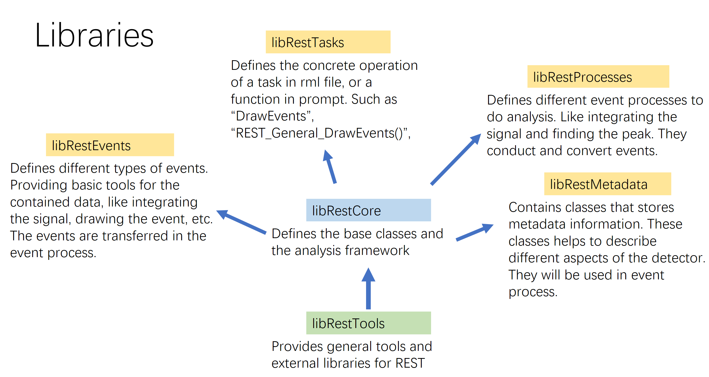
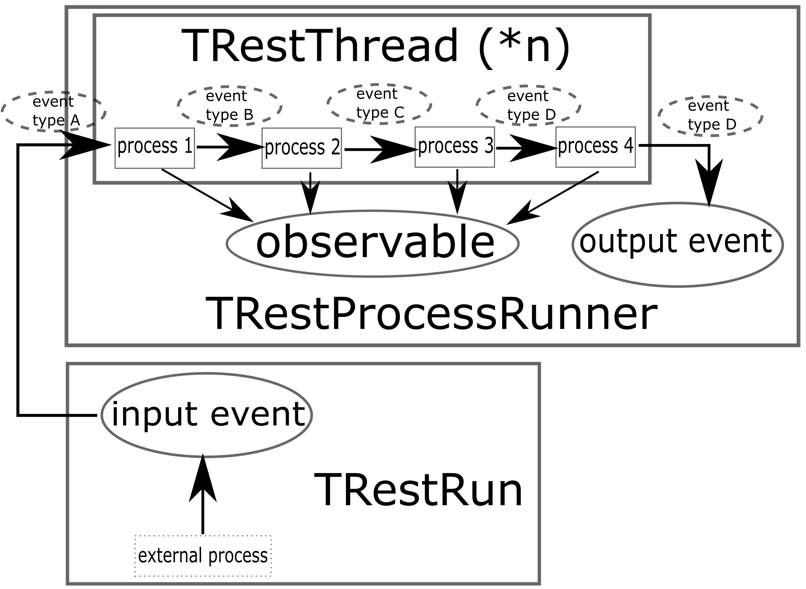

## The REST Framework

REST is developed based on ROOT. It provides additional classes for the data analysis. The property of REST's
analysis lies in its the event-orientation. An event is the collection of all physical existence due to one 
incident particle. Events are independent from each other, while their content is from a same random process 
in a same run. In REST we define several types of events, such as RawSignalEvent, SignalEvent, HitEvent and 
TrackEvent. We also define process classes to deal with these events, to make analysis for them or to change
types between them. Some configuration and definitions are needed to make a process, so we define metadata 
classes to read config file with specific format, or to save/load the object into/from a ROOT file.

REST is organized with several libraries. The center of them is libRestCore. Inside this library we have several 
base classes which builds up the whole framework of REST. libRestCore relies on the library libRestTools, which
provide some basic tools(string tools, output tools, units tools) and some external codes. Up on libRestCore, 
other REST libraries such as libRestProcesses, libRestMetadata, libRestEvents and libRestTasks are built.

Here we will talk about some important classes in libRestCore. The methods in these classes will only get their 
names mentioned. One can find their detailed usage in REST class reference.

### TRestMetadata : basic functionality of REST

We first talk about the most important class - TRestMetadata. This abstract class brings basic funcitionality 
to REST, and is the base class of many REST classes. Data member of a TRestMetadata-inherted class is defined 
inside an rml file, an xml encoded configuration file. With this configuration file the inherted class can be 
initialized. The concrete operation of its initialization is defined in the method InitFromConfigFile() by the
inherted class. This method is called during start up of the class by another method LoadConfigFromFile(), 
which parses the rml file or section as preparation. 

TRestMetadata itself is inherted from the class TNamed. It allows the save/load functionality into/from a 
ROOT file. In many cases loading from ROOT file will be much quicker than reading and parsing an rml file. 

TRestMetadata inherted class should have a name and a title. They are from TNamed class. In addition, 
we also define two basic attritubes: verbose level and storage. They controls the amount of words printed on
screen and whether the class should be saved. All those will automatically be set from the rml config file.

One major type of the inherted class is called "metadata". They contain data of, for example, the geometry 
of a simulation, the properties of a gas, the readout pattern used to "pixelize" data, etc. Usually 
we will first instantiate and save a metadata class with an rml file. In pratical use, we can just read 
it from the saved ROOT file.

Another family of TRestMetadata inherted class is called "application". Their rml file gives, for example,
the parameters of an analysis, the targets of a plot, the processes to load of an analysis, etc.
Application can do specific jobs according to the configuration.

TRestMetadata also provides some utilities for the inherted class. The most commonly used methods are: 
GetParameter(), GetElement(), GetChar(), GetDataMemberWithName(), etc. It also defines leveled string output 
tools: fout, essential, info, debug, etc. See them in the REST class reference page.

### TRestManager : managing REST applications

This class, as its name suggests, manages all other REST applications, including TRestRun, TRestProcessRunner,
and so on. A REST application has a poniter to its manager, thus it can easily get access to its sibling
applications. For example, a process class can get access to its sibling TRestRun, and acquires matadata in it.

TRestManager performs initialization for its managed applications by a strategy called sequential start up.
For example, inside the rml configuration file, there is a section declared as "TRestManager". And in this
section there is some child sections declared by different application names(here we have "TRestRun", 
"TRestProcessRunner"). TRestManager will try to instantiate objects of corresponding applications by calling
the method TClass::GetClass(). Then it call the applications' LoadConfigFromFile() method giving them the 
defined child sections. If the application also contains TRestMetadata-inherted class which can be initialized 
through rml file/sections, its section will have its own child section(here we have "TRestReadout"). 
And this grandchild section is given to the grand-resident class in that application. This is sequential startup.

`<TRestManager ... >`  
&emsp;`<TRestRun ... >`  
&emsp;&emsp;`<TRestReadout ... >`  
&emsp;&emsp;&emsp;`...`  
&emsp;&emsp;`</TRestReadout>`  
&emsp;`</TRestRun>`  
&emsp;`<TRestProcessRunner ...>`  
&emsp;&emsp;`...`  
&emsp;`</TRestProcessRunner>`  
&emsp;`<addTask .../>`  
&emsp;`<globals>`  
&emsp;&emsp;`...`  
&emsp;`</globals>`  
`</TRestManager>`  

In short, we perform sequential startup by constructing a same hierarchy in rml file with REST classes. This 
helps to make the code and conifig file easier to read. 

An xml section declared as "globals" is also in the TRestManager section, the content of it will be expanded 
into all other sections in the same level. They will not override the one which are already defined.

There is also an xml section declared as "addTask". This line actually tells TRestManager the real work
with those initialized applications. "addTask" section can either call a TRestTask type application which has 
a default behavior after initialization(talked [later](#running-with-a-root-script)), or be a C++ 
style command for TRestManager to execute. For example, we can use: 

`<addTask command="TemplateEventProcess->RunProcess()" value="ON"/>`,

and TRestManager will invoke the method "RunProcess()" in the application named "TemplateEventProcess". This 
application should be defined in previous sections.

### TRestRun : operating files and handling data

TRestRun is an application class hosting REST metadata classes and operating files.
Usually, when REST is running, an instantiated TRestRun object opens a saved ROOT file to provides the metadata 
and eventdata. When the framework finishes its run, this object in turn helps to create output file and save 
the result data. As a result, TRestRun is a data handler among the whole framework, which is very important.

Some methods are frequently called by other classes to get event/meta data: GetNextEvent(), GetEntry(), 
ImportMetadata(), GetMetadata(), etc. There are also some methods for file operation: OpenInputFile(), FormFormat(), 
MergeProcessFile(), CloseFile(), FormOutputFile(), etc. 

Usually there is a "TRestRun" section inside the "TRestManager" section in the rml file. We use lines like: 

`<addMetadata name="PandaReadout_MxM" file="readouts.root"/>`

to import a metadata object from saved ROOT file.

### TRestEvent & TRestEventProcess : data and analysis

TRestEventProcess is another important application class. It is a base class for all REST pre-defined processes.
TRestEvent is directly inherted from TObject. It is a base class for all REST pre-defined event types.

Besides the functionality of reading configuration from file, TRestEventProcess defines extra interfaces for 
its inherted class to do the job. The method InitProcess() and EndProcess() are used as preparation/completion 
steps before/after the process loop. The method ProcessEvent() is the main method of the loop. It receives 
an input TRestEvent and returns a new output TRestEvent. The input and output events are in concrete type 
inherted from TRestEvent. 

TRestEventProcess can also output analysis result to a tree. This kind of analysis result is called "observable".
For example, TRestRawSignalAnalysisProcess will add a branch in the output tree called "BaseLineSigmaMean". 
This observable is the value of average baseline RMS of the input TRestRawSignalEvent. By switching on/off 
the observable in the config file, user can change the output of this process. Observbles can only be double
type, and the user must call the method TRestAnalysisTree::SetObservableValue() during the process.

A special kind of TRestEventProcess is called ExternalProcess. They usually open a/several raw data files
(e.g. binary signal readout file) and directly generate output event. Their input event is null and
they cannot save any observables in the tree.

REST uses chained process to do anslysis. For exapmle, In a practical detection run we get the raw readout 
waveform. The data file is first converted into type TRestRawSignalEvent by some processes. Then we go forward 
with the envolution of event type. The defined process TRestSignalZeroSuppresionProcess converts the type
TRestRawSignalEvent into TRestSignalEvent type (cutting out the baseline and extracting the pulse). We redord 
the observables(baseline level, rms, etc) during the process. To go further we also have 
TRestSignalToHitProcess, which maps the channel id with their physical location according to an external 
readout file. The signal will be convered into 3D hit points. Finally we are able to draw a hit map or an 
energy spectrum with spacial cut.

In this way, an event is conducted and analized by a chain of processes. It is conducted with the changing 
representation of TRestEvent. During the process, we extract its information, mix our definition, and change 
its representation into the very processed type. We could finally get a close reconstruction to the event's 
physical truth.

### TRestProcessRunner : running analysis in an efficient way

All TRestEventProcess objects are managed by TRestProcessRunner, which enables multi-threading, chain 
validation, output handling, etc. This application class makes several copies of the process chain and keeps 
each of them in a thread. Any number of threads are supported with siginificant improvement of process 
efficiency. During the event process, the thread first asks TRestProcessRunner for an input event, which
in term asks its sibling TRestRun object for the next event from input file. After processing, the thread
will ask TRestProcessRunner to make a save for its output event. The runner copies the thread's tree's 
branch address to its own tree, and call TTree::Fill() afterwards. However, REST deals with data files with 
usually very large size, so heavy IO stress are exerted on disk. As a result, too much threads will not be helpful
to the higher efficiency.

TRestProcessRunner is able to save a snapshot of the values of the class members for each managed TRestEventProcess 
objects in a corresponding branch. This is regarded as an alternative of saving observables as analysis result. 
The user can switch off the saving by using an annotation like `//!` at the end of the class member definition. 
This saving supports not only double type, but also int, vector, map, etc., which makes the analysis more 
flexible.

We also implemented a test run functionality in the runner. It tries to give an input event to the process chain
and receives the output event. It will then know the memory address of the output event and therefor be able to 
config the output tree. In old times we must instantiate a TRestEvent object for the output of an event process, 
and copy the data from input event(if the process dosen't change the event type). Now we can simply copy the 
address of the input event and directly operate it. This will also improve the efficiency and simplify the code.

[**prev**](3-try-some-examples.md)
[**contents**](0-contents.md)
[**next**](5-using-rest.md)