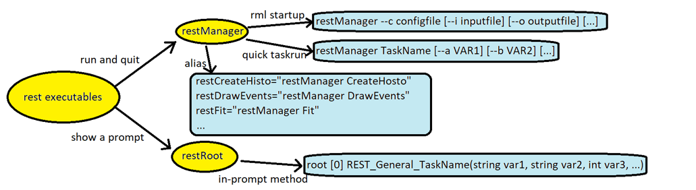
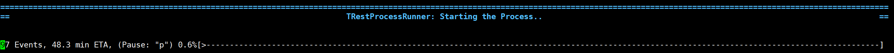
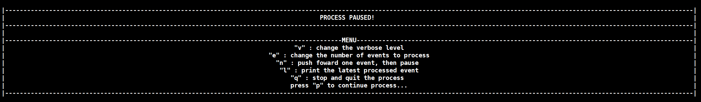
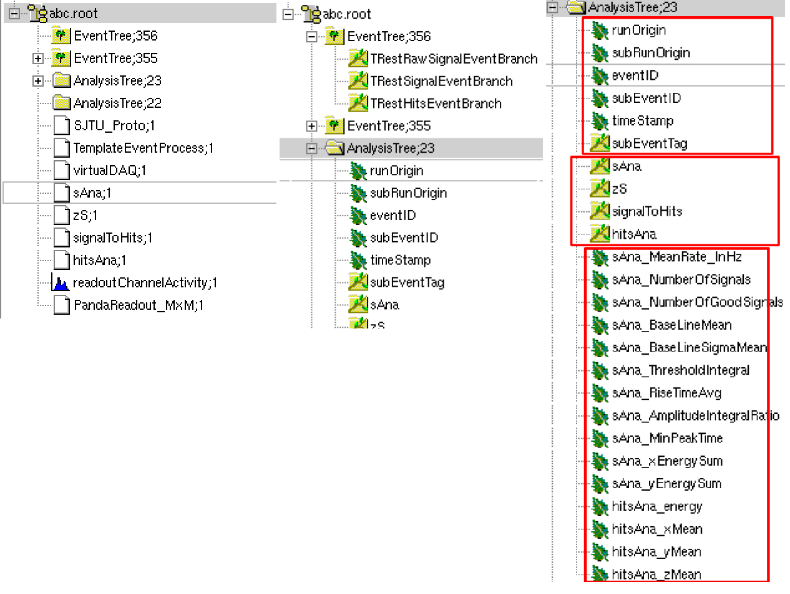
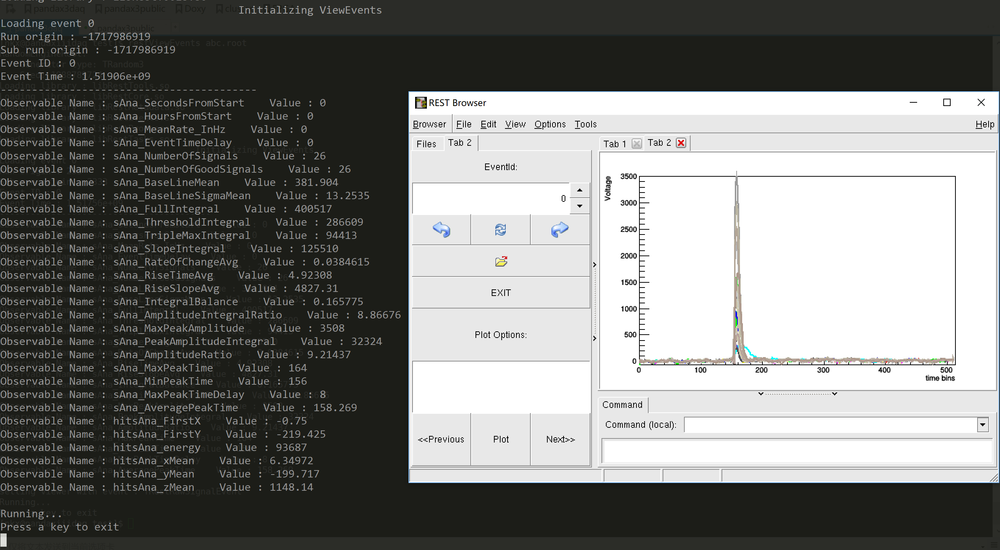
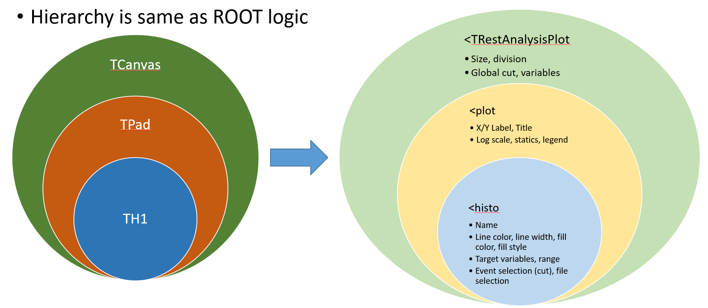
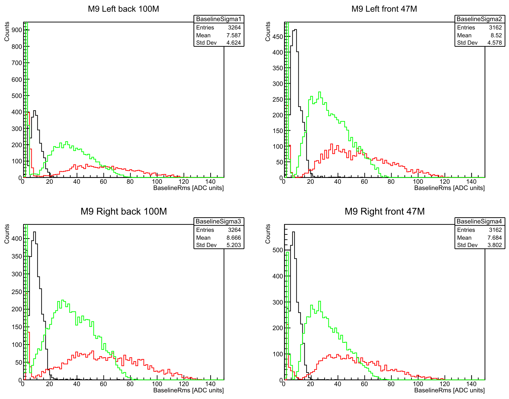

## Using REST

REST in all provides two main executables, several ROOT scripts, several alias calling the scripts, plus a shell
script containing REST system infomation. 

`restManager` is the main program of REST. It can run in two modes: rml config mode and scripts executing mode.
"restManager" calls TRestManager class to parse both rml config file and script file.

In rml config mode, the usage is like:

`restManager --c CONFIG_FILE [--i INPUT_FILE] [--o OUTPUT_FILE] [--j THREADS] [--e EVENTS_TO_PROCESS] [--v VERBOSELEVEL]`.

Here we must give the rml config file to the program. Other arguments with squared brackets are optional. If given,
they will overwrite the corresponding parameters in rml file.

In scripts executing mode, the usage is: 

`restManager TASK_NAME ARG1 ARG2 ARG3`

User needs to specify the script name and type the argumens in sequence. REST will automatically find and load the 
corrsponding script file. The script files contains a c++ function each, so called "macro". Those files are stored 
in the "macro" directory in installation path. 

Shell alias are set together with some of those macros. For example, the command `restViewEvents` is actually alias
of the command "restManager ViewEvents". So we can also run restManager like: 
`restViewEvents abc.root TRestRawSignalEvent`. This is as if we have many other executables.

The other executable is `restRoot`. It is identically ROOT with additional REST libraries and macros loaded.
The loaded library enables us to operate REST objects or data trees saved in TFile. The macros, being same as
what we mentioned above, enables us to do the same thing as above, similary in root prompt. The name is a little
different. For example:

`REST_ViewEvents("abc.root","TRestRawSignalEvent")`  

Note that REST output file can only be opened by "restRoot". Trees and metadata objects can be reterived
successfully. TBrowser also works for REST objects. For example:

`TBrowser a`  
`AnalysisTree->Draw("XXX")`  

Finally we have a shell script `rest-config`. It provides some basic infomation of REST, including
installation date/directories, branch, commit id, compilation flags, etc. Try `rest-config --help` for 
more details.

### Writing rml to process file

Here we will talk about the detailed options of rml config file for restManager. We usually have a 
"TRestRun" section, a "TRestProcessRunner" section, a "globals" section and some "addTask" section under 
the root section "TRestManager". "TRestRun" section and "TRestProcessRunner" section corresponds to the 
two REST metadata objects managed by TRestManager. They cooperate with each other.

#### name, title and verbose level

TNamed class introduces name and title as datamembers for the objects of its inherited class. In addition,
TRestMetadata introduces verbose level option. We need to set all three of them as basic information for
any TRestMetadata inherited class objects. Use xml attributes or child sections "parameter" to set them. 
For example:

`<TRestProcessRunner name="TemplateEventProcess" verboseLevel="info">`
&emsp;`<parameter name="title" value="A Template of REST Analysis" />`  
&emsp;`...`
`</TRestProcessRunner>`

There are five verbose levels one can choose, and the parameter "verboseLevel" can either be a number value 
or a string value.

level | number | string | Description
-------------|------------|-----------------|------------
REST_Silent       | 0      | silent           | Show minimized information of the software, as well as error messages
REST_Essential    | 1      | essential        | +Show some essential information, as well as warnings
REST_Info         | 2      | info             | +Show most of the infomation. Print some values during the process
REST_Debug        | 3      | debug            | +Show debug messages. Print detailed values and pause at each event during the process. multithread is disabled
REST_Extreme      | 4      | extreme          | Show everything. Pause at each process to show the details

The default verbose level for a TRestMetadata inherited class is silent/info before/after
loading the rml file(calling the method "LoadConfigFromFile()").

#### setting run information

Physically, a "run" is a continuous data taking during which all the detector's configuration maintains
a constant. We can set run information in "TRestRun" section and they can be saved in output file.

Below is a list of run info datamember in the class TRestRun. They can be set with a line like:
`<parameter name="experiment" value="PandaX-III"/>` under the section "TRestRun".

item | type | rml parameter name | Description
-------------|------------|-----------------|------------
fRunNumber       | int      | runNumber           | first identificative number
fParentRunNumber | int      | ~~~~                | ~~~~
fRunClassName    | TString  | ~~~~                | ~~~~
fRunType         | TString  | runType             | Stores bit by bit the type of run. e.g. calibration, background, pedestal, simulation, datataking 
fRunUser         | TString  | user                | To identify the author it has created the run. It might be also a word describing the origin of the run (I.e. REST_Prototype, T-REX, etc)
fRunTag          | TString  | runTag              | A tag to be written to the output file
fRunDescription  | TString  | runDescription      | A word or sentence describing the run (I.e. Fe55 calibration, cosmics, etc)
fExperimentName  | TString  | experiment          | The experiment name

#### adding metadata

REST metadata objects is managed by TRestRun. They provides, for example, gas definition or readout definition
to the processes to use. So inside the "TRestRun" section we need to add metadata. It is possible to either 
import them from a ROOT file or to generate new. 

To import them from file we need to use a line like:  
`<TRestRun ...>`  
&emsp;`<addMetadata name="PandaReadout_MxM" file="readouts.root"/>`,  
`</TRestRun ...>`  
where we input the name of the matadata object and the name of the file. This is a recommended way to add metadata
as it is faster. One can spend some time generate definition files for the detector, then other users need not to do 
it again.

TRestRun supports sequential startup to generate new metadata. We add a full definition of the
class TRestReadout as an example: 

`<TRestRun ...>`  
&emsp;`<TRestReadout ...>`  
&emsp;&emsp;`<readoutModule .../>`  
&emsp;&emsp;`<readoutPlane ...>`  
&emsp;&emsp;&emsp;`<addReadoutModule .../>`  
&emsp;&emsp;&emsp;`<addReadoutModule .../>`  
&emsp;&emsp;&emsp;`<addReadoutModule .../>`  
&emsp;&emsp;&emsp;`...`  
&emsp;&emsp;`</readoutPlane ...>`  
&emsp;`</TRestReadout>`  
`</TRestRun>` 

In this case, TRestRun will give the <TRestReadout section to a new TRestReadout instance, and calls its method
`LoadConfigFromFile()`. In this method, TRestReadout will initialize the readout structure according to the given
rml section. After this, the new metadata TRestReadout is prepared and stored. It will be ready to use by the 
processes.

#### adding process and its observables

Now we are going to add processes and define the needed output observables. In the section "TRestProcessRunner"
we add sections like `<addProcess type="TRestRawSignalAnalysisProcess" name="sAna" value="ON" file="processes.rml"/>`.
We have to specify the type and name. In addition, we can use the option "value" to switch on/off the process 
in the analysis chain. The "file" attribute defines the include file whose content will be expanded into this section.

All the observables are calculated in the process no matter whether they are added. By default, all of them are
written to the AnalysisTree. We can also choose to write partial observables in case we want to reduce storage 
or to have a cleaner tree. To do so, we need to manually write sections like: 
`<observable name="ThresholdIntegral" value="ON" />` as the child sections of the `<addProcess` section. In case 
there are too many observables and parameter to define, which may cause a mess in the rml file, 
we use include definition in the example.

#### input file and external process

The input file must be given to TRestRun to run an analysis. If the input file has .root extension, then 
it will be regarded as REST data file and will be directly opened. If not, we must have an external process
in TRestRun to extract events from it. The "addProcess" section for external file processes can both be in 
section "TRestRun" and section "TRestProcessRunner". There can only be one external process added, and it
is running under single threaded mode.

#### changing saved branches

Some parameters in section "TRestProcessRunner" changes the branches to save in the two output trees. They are:  
`<parameter name="inputAnalysis" value="on"/>`  
`<parameter name="inputEvent" value="on"/>`  
`<parameter name="outputEvent" value="on"/>`  

"outputAnalysis" (i.e. AnalysisTree) is always saved. If the user turns on "outputEvent", then the output event 
will be saved. It is by default on. "inputEvent" means all the event types appeared in the analysis chain. 
If the user turns on "inputEvent", then "outputEvent" will be automatically turned on. If the user turns on 
"inputAnalysis", then when the input file is a root file, observables in it will be copied to the output file. 

If two processes have different input/output event(different data) but with same type, only the one from the
later process will be saved.

By default all these three settings are on in REST. If the user wants to save some disk space, he can choose to
save analysis items only(turn off events). Or if he only wants a view of the last processed event, he can choose 
to save output event only.

#### changing event region

Three parameters in section "TRestProcessRunner" changes the region of events to process. They are:
"firstEntry", "lastEntry" and "eventsToProcess". If they are all zero, then the input file will have its all
events processed. If the parameter "eventsToProcess" is non-zero, then the process will be stopped after it 
reaches the number. The parameter "firstEntry" and "lastEntry" is only effective when the input file is a
REST data file. They determines the entry region in the tree to extract events to process. "lastEntry" will
be overwritten by a non-zero "eventsToProcess".

REST counts processed events number by the number of **saved events**. If there is a cut in some process and the
event is not saved, we need to read more events than the given number. If there is many threads working together,
the actual saved event number will be silghtly bigger than required.

#### search path for definition files

If the specified include rml/root file is not in absolute path, REST will find it sequentially in:
1. current dir
2. dir specified in section "searchPath"
3. the dir where the rml file is placed
4. $REST_PATH/data

Usually we put the "searchPath" section in "globals" section to be seen by all the metadata classes.
The following is an example:  
`<globals>`  
&emsp;`<searchPath value="$ENV{REST_PATH}/data/definitions/:$ENV{REST_PATH}/data/gasFiles/"/>`  
`</globals>`  

The value of "searchPath" is in linux env style with ":" separating multiple paths. Alternativally 
on can define multiple "searchPath sections together, this is also vaild.

In the example the directoty "$ENV{REST_PATH}/data/definitions" stores many pre-defined rml files 
for readout, processes and gases. The detailed organization of the directory "inputdata" can be found 
in the appendix. [REST pre-definition data](#rest-pre-definition-data)  

#### output file: naming and saving

REST also enables auto-naming of the output file. By using square brackets in the "outputFile" parameter in TRestRun
section, the user can have REST trying to replace the strings. For example, we can have a the parameter written like:

`<parameter name="outputFile" value="RUN[RunNumber]_[Time]_[LastProcess].root" />`  

The replace work is done as follows:  
1. replace with system environmental variable(done in rml parsing step)
2. replace with the file info  
3. replace with the process info  
4. replace with the run info  

There are some public keywords for replacement in REST:

source | item | Description
-------------|------------|------------
file info       | Time                 | The last write time of the input file
file info       | Date                 | The last write date of the input file 
file info       | Size                 | The size of input file  
file info       | Entries              | The total entries of input file (if is REST data file, otherwise = 2e9)        
process info    | FirstProcess         | The name of first event process         
process info    | LastProcess          | The name of last event process
process info    | ProcNumber           | The number of processes
run info        | [see the table above ](#setting-run-information)  | ~~~~

In future we may add more keywords. The user can also add his own file info keywords from the input file name.
What he needs is to add another parameter line like:  
`<parameter name="inputFormat" value="run[RunNumber]_cobo[CoBoId]_[Fragment].graw"/>`  
Therefore REST will match the input file name with the given format. For example, when file name is:
"run00042_cobo1_0000.graw", then item "RunNumber" with value "00042", item "CoBoId" with value "1", and item
"Fragment" with value "0000" will be added into file info. 

Let's assume that the graw file is created in 2018-01-30 16:30, and the last event process is a 
TRestRawSignalAnalysisProcess with a name "sAna", then the output file name will be:
"RUN00042_16:42_sAna.root".

The default auto naming is:  
`Run_[fExperimentName]_[fRunUser]_[fRunType]_[fRunTag]_[fRunNumber]_[fParentRunNumber]_V[REST_RELEASE].root`

Another parameter "mainDataPath" defines the path of saving output file. By default REST saves the output file 
at current directory. When "mainDataPath" is specified, the output file is saved in this directory. We can set 
it in "globals" section. For example:

`<globals>`  
&emsp;`<parameter name="mainDataPath" value="../" />`  
`</globals>`  

then all the output file will be saved in the parent directory.

#### the "addTask" command

Don't forget to add an "addTask" section after all the sections are completed. We invoke the method RunProcess()
in TRestProcessRunner to run the analysis. Here we need a line in "TRestManager" section like:  
`<addTask command="TemplateEventProcess->RunProcess()" value="ON"/>`.  
Here "TemplateEventProcess" is the name of the TRestProcessRunner object defined previously.

It is also possible to directly use a line:  
`<addTask type="processEvents" value="ON" />`.  
This asks TRestManager to directly call start of TRestProcessRunner object.

### During processing

When we have prepared the rml file, we can start the process! The command is like following:

`restManager --c multiCoboAnalysis.rml --i /data2/7MM/graw/CoBo_AsAd0_2017-12-23T17\:24\:04.657_0000.graw --o abc.root`

REST will show a progress bar with timing during the process.

The remaining time is calcluated by the proceeded precentage in the last 10 seconds, while the precentage
is calculated by(ordered by priority):  

1. saved events / eventsToProcess
2. readed bytes / size of input binary file
3. readed events / totalEntries of input root file

Pause menu is also available during the process. It can be called out by pressing "p" and then "enter". 
Functionalities like changing verbose level, printing current event or exiting with saving, etc. is provided 
in the menu. As shown in the following figures.

A general case is that when we are doing processing and want to terminate the program. If we directly use 
"ctrl-c", we will loose all the processed data. So we can stop REST with the help menu, by simply pressing "q"
in it.

### REST data format

REST saves an event tree, an analysis tree, some metadata objects, and additional analysis output
objects in extended root format. The file can be opened by root after loading REST libraries. We 
first observe the file structure in TBrowser.

The `EventTree` is typically a ROOT tree saving branches of event classes, i.e. `TRestRawSignalEvent`, 
`TRestSignalEvent`, `TRestHitsEvent` in the figure. These pre-defined data types are saved by the 
default ROOT logic, with sub-branches created in shape of class inheritance. We don't usually plot and 
analyze data directly on that tree.

The `AnalysisTree` are in type `TRestAnalysisTree`, which is inherited from ROOT tree in convenience for
managing observables. Inside this tree there are six branches saving some basic event information: 

* run ID
* sub run ID
* event ID
* sub event ID
* time stamp
* event tag

The **observable** is a kind of analysis result saved in the tree. We will talk about it in 
section [7.3.2](7-base-class-interface-reference.md#using-observables-to-save-the-result). 
To look the data we just do the same as we do in ROOT, like typing `AnalysisTree->Draw("XXXX")`
in the prompt or directly double click the item.

The naming of observables are conventional. The process name and the observable name is connected 
with an undermark. For example the branches "rA_FirstX", "bM_CPUPercentage" in the figure follows
that convention. 

The data type of observables are not fixed. In most cases we do analysis in `double` to have best
precision, and the observables are double. Sometimes we want to save disk space, then `float` is 
better. To express descrete values, we may also use `int`. In special cases there are multiple 
values to save for a event, then we need to use **stl containers**. `vector` or `map` may both 
occur in the tree. 

Several metadata and core class objects are also saved in file. They are used for recovering the setup
of that analysis run. For example, when one gets a REST file from others, he can quickly know the 
parameters used by `TRestRawSignalAnalysisProcess` (here named "sAna") at that time, by printing its 
information.

Finally, REST allows processes to save some ROOT analysis objects in the file. Here the TH1D
"ChannelActivity_M3" is saved by the process "rA" (of type TRestReadoutAnalysisProcess). We can 
directly draw it.

### Browsing and viewing events

Events in REST data files are managed by TRestRun, whose graphical interface, in turn, is shown by
by TRestBrowser. This class shows a TBrowser window during initialization. In the window there is a 
canvas showing the current event, and a control panel to switch between events. 

In restRoot prompt, by using TRestBrowser, one can easily get accsess to the file's events, and don't
need to manually instantiate a TRestEvent object and set the tree's branch address. He just needs to type:  
`restRoot abc.root`  
`TRestBrowser a`  
`TRestxxxEvent*eve=(TRestxxxEvent*)a.GetInputEvent()`,  
and will be free to operate this event.

By default TRestBrowser extracts the last event in file, and draws it in the canvas by using the viewer
class TRestGenericEventViewer. This viewer just calls the default method TRestEvent::Draw(). Other viewers
like TRestHitsEventViewer or TRestG4EventViewer are also available. Some pre-defined bash alias and ROOT 
scripts can be used to draw these events in differently. In bash, we can directly start a event viewer 
window with commands: "restViewEvents abc.root", "restManager ViewHitsEvents hits.root". In restRoot 
prompt, we can call the function: "REST_ViewEvents("abc.root")" to start the event viewer.

Here for example, we use the generated file in [example](process-a-raw-data-file), and call the command 
`restViewEvents abc.root`. The last event is TRestRawSignalEvent type in this file, and a TRestBrowser
window will show up drawing the waveforms. In the command line it will print observable values.

In the TRestBrowser window, on the right side there is a combined plot of the event, which contains 
several individual signal waveforms. In the left side we have a control panel. The arrow buttoms and the 
text box in upper area helps to switch next/previous/specific event. The browser also supports plot 
options. If we click on the lower buttoms, for TRestRawSignalEvent it will plot next/previous/specific
signals inside the current event.

Some viewer processes are also available in REST. The user can have a view of the events during 
the process. All the viewer processes are single thread only, and TRestProcessRunner will automatically
roll back to single thread mode with a viewer process in process chain. 

### Plot the analysis result

It is possible to plot histograms from observables in output file with rml configuration. REST has a core class 
called TRestAnalysisPlot. It generates plot string according to the rml and calls TTree::Draw() to draw the 
histogram. Then it will save the plots to a pdf file or ROOT file.

To use it, a "TRestAnalysisPlot" section is needed in "TRestManager" section. The template of rml config file 
for TRestAnalysisPlot can be found in ./examples/plotAnaSpectrum.rml. It shall follow the rules below. The 
command to call for plotting is like:  
`restManager --c plotAnaSpectrum.rml --i abc.root --p ouput.pdf`  

#### add input file

The input file of analysis plot is given in a same way as process chain. One can either write `--i XXX.root`
in the command line, or to write a TRestRun section, and define parameter input file inside it. Multiple
input files are supported.

Sometimes we want to run a process chain and see the result on analysis plot at once. Then we just need to 
add the `<TRestAnalysisPlot` section after `<TRestProcessRunner` section. REST will automatically use the 
output file of processes as the input file as analysis plot.

#### defining plot and histo

The definition of plot objects inside the rml file follows the section hierarchy:

* TRestAnalysisPlot
* plot
* histo

At each level we have different parameters to set. Under the main TRestAnalysisPlot section, we first add 
a section like:  
`<canvas size="(1000,800)" divide="(2,2)" save="plot.pdf" />`  
This defines the canvas and divide it into several pads. Each pads is configured by the following `<plot` 
section:  
`<plot name="Spectrum_CutImpact" title="Impact of cut on the spectrum" xlabel="Threshold integral energy [ADC units]" ylabel="Counts" logscale="true" legend="on" annotation="on">`  
...  
`</plot>`
This sets the axis title and switch the log scale. We can also call to add additional objects on the plot,
i.e., legend and annotation.

Under the plot we need to add histo. It is possible to add multiple histograms on a same plot for 
convenience of comparing. The histo section is like:  
`<histo name="noCuts">`  
&emsp;`<variable name="sAna_ThresholdIntegral" nbins="100" />`   
&emsp;`<parameter name="lineColor" value="1"/>`  
`</histo>`  
, where we define the used variables and the drawing style. The variable is same as "observable" in
AnalysisTree in input file. If we add one variable, then it draws a TH1. If we add two variables, 
it draws a TH2, whose X axis is the first added variable. Number of bins and range of variable can 
both be set.

Note that if there is only one histogram, the content inside `<histo` section can also be put inside 
`<plot` section, in order to reduce the code.

#### cuts and file selection

Now we define another histogram with some cuts:  
`<histo name="BaseLine">`  
&emsp;`<variable name="sAna_ThresholdIntegral" nbins="100" />`   
&emsp;`<cut variable="sAna_BaseLineSigmaMean" condition="&lt;12" value="ON" />`  
&emsp;`<parameter name="lineColor" value="2"/>`  
`</histo>`  

In this example we add a cut that the observable "sAna_NumberOfGoodSignals" should be greater than 1. 
Note that standard xml needs escape string to express the symbol `>`. Though this symbol still works 
out of some reason, we suggest using `&gt;` instead of `>` for a good habit.

REST supports multiple input files for analysis plot, also by inputing quoted file name pattern in the `--i` 
argument. All the files will contribute to the plotted histogram. Sometimes we want to draw two histograms 
from two different files to compare, then a **filter** for the files is needed. We can add a `<classify`
section under this `<histo` section. For example, `<classify runTag="NLDBD"/>` selects only the files 
with run tag equals to "NLDBD". The run tag is a TRestRun data member saved in file. Despite TRestRun 
information, other supported fields of classification include FileName, Date, Size, etc.

[**prev**](4-the-rest-framework.md)
[**contents**](0-contents.md)
[**next**](6-some-metadata-classes.md)
