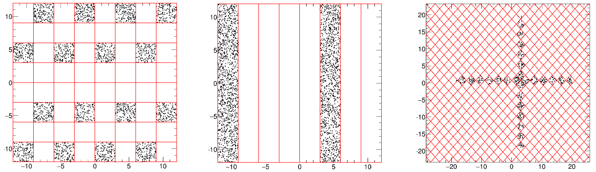

## Some Metadata Classes

In this section we will talk about the usage of REST metadata classes. They load useful information 
about the experiment setup from rml config file. How to write those files is what the user should know.

### TRestGas

The TRestGas metadata members description can be found detailed in the TRestGas class documentation. 
Here we provide few commands to show how to generate a new gas mixture and access its basic properties, 
as drift velocity, electron diffusion, and typical gas coefficients.

#### create TRestGas object

TRestGas loads gas condition with the following rml section:

(File : argonMixture.rml)

`<TRestGas name="Argon-Isobutane 4Pct 10-10E3Vcm" title="Argon-Isobutane Mixture (4Pct Isobutane)" generate="on">`  
&emsp;`<searchPath value="${REST_INPUTDATA}/gasFiles/"/>`  
&emsp;`<parameter name="pressure" value="10" />`  
&emsp;`<parameter name="temperature" value="293.15" />`  
&emsp;`<parameter name="maxElectronEnergy" value="400" />`  
&emsp;`<parameter name="W_value" value="26.145" />`  
&emsp;`<parameter name="nCollisions" value="10" />`  
&emsp;`<eField Emin="10" Emax="1000." nodes="20" />`  
&emsp;`<gasComponent name="ar" fraction="0.96" />`  
&emsp;`<gasComponent name="iC4H10" fraction="0.04" />`  
`</TRestGas>`  

We first create TRestGas object manually in restRoot:

:~$ `restRoot`

[0] `TRestGas *gas = new TRestGas( "argonMixture.rml", "Argon-Isobutane 4Pct 10-10E3Vcm")`

Note that the field value "generate" is "on" in the rml file. TRestGas will call Garfield to run 
several simulations with different E field. After few hours of running, we can get gas properties 
of these points. The table will be saved in a file for the convenience of next startup. We keep a 
database of varies gas tables in https://github.com/rest-development/gasFiles.

Now we quit restRoot and modify the rml file, changing "generate" to "off", and repeat the previous
work:

[1] `.q`

:~$ `sed -i 's/generate="on"/generate="off"/g' argonMixture.rml`

:~$ `restRoot`

[0] `TRestGas *gas = new TRestGas( "argonMixture.rml", "Argon-Isobutane 4Pct 10-10E3Vcm")`

We can see the gas table has been loaded. The start up is much faster.

#### get gas property

We can now access the members of TRestGas to obtain the values for the drift velocity or the 
tranversal electron diffusion. The following command will print on screen the drift velocity.

[1] `cout << "The drift velocity at 100 V/cm is : " << gas->GetDriftVelocity( 100 ) << endl`

We can find the information of the gas you are using by calling PrintMetadata().

[2] `gas->PrintMetadata()`

We can also quickly visualize the dependency of different gas properties as a function of the field. 
The following code will plot the drift velocity at 10 bar, for a field range between 1V/cm and 1000V/cm 
drawing 100 extrapolated points.

[3] `gas->PlotDriftVelocity( 1, 1000, 100 )`

When we change the gas pressure, since the drift velocity is related only to E/P, we can directly use
this retrieved TRestGas class.

[4] `gas->SetPressure( 5 )`

[5] `gas->GetDriftVelocity( 100 )`

[6] `cout << "The drift velocity at 100V/cm at 5 bar is : " << gas->GetDriftVelocity( 100 ) << endl`

#### save as metadata

When TRestGas is saved in root file, there will no need for calculation next time. The content of gas 
table will be saved together, and by calling InitFromRootFile() it can be loaded again.

We first reset the pressure and make sure the gas table is loaded.

[7] `gas->SetPressure( 10 )`

Then we saved it manually in a root file.

[8] `TFile*f=new TFile("argonMixture.root","RECREATE")`

[9] `gas->Write()`

[10] `f->Close()`

[11] `.q`

Alternativelly we can do this through a restManager command in bash:

`restManager --c saveGas.rml --o argonMixture.root`

with "saveGas.rml" contains:

//we write a config file saveGas.rml  
`<TRestManager verboseLevel="silent">`  
&emsp;`<TRestRun name="run">`  
&emsp;&emsp;`<TRestGas name="Argon-Isobutane 4Pct 10-10E3Vcm" file="argonMixture.rml" generate=off/>`  
&emsp;`</TRestRun>`  
&emsp;`<addTask command="run->FormOutputFile()" value="ON"/>`  
`</TRestManager>`  

REST will use the previous gas table to create TRestGas object. Then it will save the object in a root file 
named "argonMixture.root". 

#### use gas metadata file

Gas metadata file can be directly used in restRoot:

:~$ `restRoot`

[0] `TFile*f=new TFile("argonMixture.root")`

We retrieve the saved TRestGas object and plot drift velocity

[1] `TRestGas*g=(TRestGas*)f->Get("Argon-Isobutane 4Pct 10-10E3Vcm")`

[2] `g->InitFromRootFile()`

[3] `g->PlotDriftVelocity( 1, 1000, 100 )`

When used in analysis, we need to add metadata in TRestRun. The rml file is like:

`<TRestManager name="RESTManagerSim" title="Template manager to process a simulation generated by restG4.">`  
&emsp;`<TRestRun name="Run metadata" title="REST Metadata run info (template)">`  
&emsp;&emsp;`<addMetadata type="TRestGas" name="Argon-Isobutane 1Pct 10-10E3Vcm" file="argonMixture.root"/>`  
&emsp;`</TRestRun>`  
&emsp;`<TRestProcessRunner name="TemplateEventProcess" verboseLevel="info">`  
&emsp;&emsp;`...`  
&emsp;`</TRestProcessRunner>`  
&emsp;`<addTask type="processEvents" value="ON" />`  
`</TRestManager>`  

In the thrid line we add TRestGas from the root file. This will be used by certain processes.

That's it. Other gas parameters and relevant information related to TRestGas can be found in the class 
documentation.

### TRestReadout

We will address two different examples following basic readout topologies. You will find a variety of 
more complex examples at REST_v2/data/definitions/readouts.rml. More details about readout 
construction are available at the documentation of TRestReadout class. The class TRestMetadata describes 
detailed information on how to write RML files.

#### a basic pixelated readout 

In this example we generate a readout with a single readout plane, and one pixelated readout module 
placed inside. To achieve that each channel has a unique pixel definition.

// We define some environmental variables that we can later use as ${VARIABLE}  
`<globals>`  
&emsp;`<variable name="PIX_SIZE" value="3" overwrite="true" />`  
&emsp;`<variable name="CHANNELS" value="8" overwrite="true" />`  
`</globals>`  

`<TRestReadout name="pixelReadout" title="A basic pixel readout. ${CHANNELS}x${CHANNELS} channels. Pixel size : ${PIX_SIZE} mm" >`

&emsp;// These parameters are later keywords inside the section  
&emsp;// and will be substituted by their value.  
&emsp;`<myParameter name="nChannels" value="${CHANNELS}" />`  
&emsp;`<myParameter name="pixelSize" value="${PIX_SIZE}" />`  

&emsp;// Mapping nodes is the number of nodes N, in a NxN grid.   
&emsp;// This grid allows for faster channel/pixel finding algorithm.  

&emsp;// If the mappingNodes value is 0. The value will be automatically assigned by REST.  
&emsp;`<parameter name="mappingNodes" value="0" />`  

&emsp;// This is just the module definition.   
&emsp;`<readoutModule name="pixelModule" size="(nChannels*pixelSize, nChannels*pixelSize)" tolerance="1.e-4" >`  

&emsp;&emsp;// We use for loops to generate any number of channels given by the CHANNELS variable.  
&emsp;&emsp;// The loop variable must be placed between [] in order to be evaluated.  
&emsp;&emsp;`<for variable="nChX" from="0" to="nChannels-1" step="1" />`  
&emsp;&emsp;&emsp;`<for variable="nChY" from="0" to="nChannels-1" step="1" />`  

&emsp;&emsp;&emsp;&emsp;// The readout channel id will be used to identify the channel and associate it to a daq id  
&emsp;&emsp;&emsp;&emsp;`<readoutChannel id="[nChX]*nChannels+[nChY]" >`  
&emsp;&emsp;&emsp;&emsp;&emsp;// In this example we define one pixel per channel.   
&emsp;&emsp;&emsp;&emsp;&emsp;// But we can define any number of pixels inside a channel  
&emsp;&emsp;&emsp;&emsp;&emsp;`<addPixel id="0" origin="([nChX]*pixelSize, [nChY]*pixelSize)" size="(${PIX_SIZE},${PIX_SIZE})" rotation="0" />`  
&emsp;&emsp;&emsp;&emsp;`</readoutChannel>`  

&emsp;&emsp;&emsp;`</for>`  
&emsp;&emsp;`</for>`  
 
&emsp;`</readoutModule>`  

&emsp;// The real readout implementation is done inside the readout plane.  
&emsp;// The readout plane parameters define the active volume.  
&emsp;`<readoutPlane position="(0,0,-990)" units="mm" planeVector="(0,0,1)" chargeCollection="1" cathodePosition="(0,0,0)" units="mm" >`  

&emsp;&emsp;// We can add any number of modules  
&emsp;&emsp;// name="pixelModule" is the name defined at the "readoutModule" section.  
&emsp;&emsp;// We define the module position inside the readout plane  
&emsp;&emsp;`<addReadoutModule id="0" name="pixelModule"origin="(-nChannels*pixelSize/2,-nChannels*pixelSize/2)" rotation="0" />`  

&emsp;`</readoutPlane>`  

`</TRestReadout>`

By using restRoot one can manually instantiate this TRestReadout object and save it. To use restManager 
to directly generate the ROOT file, one needs to add these sections in TRestRun and TRestManager section, 
and provide an "addTask" section.

#### a multilayer stripped readout 

In this example we define a stripped readout using single pixels with y-dimension much longer than x-dimension. 
We create two readout module definitions, one for each axis, and place each readout module at a different 
readout planes.

`<globals>`  
&emsp;`<variable name="PIX_SIZE" value="3" overwrite="true" />`  
&emsp;`<variable name="CHANNELS" value="8" overwrite="true" />`  
`</globals>`  

`<TRestReadout name="strippedReadout" title="A basic pixel readout. ${CHANNELS}+${CHANNELS} channels. Pitch size : ${PIX_SIZE} mm" >`  
&emsp;`<myParameter name="nChannels" value="${CHANNELS}" />`  
&emsp;`<myParameter name="pixelSize" value="${PIX_SIZE}" />`  

&emsp;// In case of errors during the readout generation you might need to  
&emsp;// define this value manually in the mapping nodes parameter.  
&emsp;`<parameter name="mappingNodes" value="nChannels" />`  

&emsp;// X-strips readout module definition  
&emsp;`<readoutModule name="stripsX" size="(nChannels*pixelSize, nChannels*pixelSize)" tolerance="1.e-4" >`  

&emsp;&emsp;`<for variable="nChX" from="0" to="nChannels-1" step="1" />`  
&emsp;&emsp;&emsp;`<readoutChannel id="[nChX]" >`  
&emsp;&emsp;&emsp;&emsp;`<addPixel id="0" origin="([nChX]*pixelSize, 0)" size="(${PIX_SIZE},${PIX_SIZE}*nChannels)" rotation="0" />`  
&emsp;&emsp;&emsp;`</readoutChannel>`  
&emsp;&emsp;`</for>`  

&emsp;`</readoutModule>`  

&emsp;// Y-strips readout module definition  
&emsp;`<readoutModule name="stripsY" size="(nChannels*pixelSize, nChannels*pixelSize)" tolerance="1.e-4" >`  

&emsp;&emsp;`<for variable="nChY" from="0" to="nChannels-1" step="1" />`  
&emsp;&emsp;&emsp;`<readoutChannel id="[nChY]" >`  
&emsp;&emsp;&emsp;&emsp;`<addPixel id="0" origin="(0, [nChY]*pixelSize)" size="(${PIX_SIZE}*nChannels,${PIX_SIZE})" rotation="0" />`  
&emsp;&emsp;&emsp;`</readoutChannel>`  
&emsp;&emsp;`</for>`  

&emsp;`</readoutModule>`  

&emsp;// We define a first readout plane  
&emsp;`<readoutPlane position="(0,0,-990)" units="mm" planeVector="(0,0,1)" chargeCollection="1" cathodePosition="(0,0,0)" units="mm" >`  

&emsp;&emsp;// This readout plane includes the readout with the strips along Y-axis (X-position)  
&emsp;&emsp;`<addReadoutModule id="0" name="stripsX" origin="(-nChannels*pixelSize/2,-nChannels*pixelSize/2)" rotation="0" />`  

&emsp;`</readoutPlane>`  

&emsp;// We define a second readout plane covering the same active volume.  
&emsp;`<readoutPlane position="(0,0,-990)" units="mm" planeVector="(0,0,1)" chargeCollection="1" cathodePosition="(0,0,0)" units="mm" >`  

&emsp;&emsp;// This readout plane includes the readout with the strips along X-axis (Y-position)  
&emsp;&emsp;`<addReadoutModule id="0" name="stripsY" origin="(-nChannels*pixelSize/2,-nChannels*pixelSize/2)" rotation="0" />`  

&emsp;`</readoutPlane>`  

`</TRestReadout>`  

For the moment, the process TRestHitsToSignalProcess is not able to process a multilayer readout plane, 
and/or charge collection sharing between different readout planes, covering the same active volume. 
Although few changes would be needed to adapt this process.

#### readout generation and storage and recovery

Here we assume the previous examples are defined in a file named *readouts.rml* and this file is found 
at the working directory.

The following code will instantiate the TRestReadout class using the pixelated and stripped definitions, 
and save them to a ROOT file.

:~$ `restRoot`  

[0] `TRestReadout *pixRead = new TRestReadout( "readouts.rml", "pixelReadout");`  

[1] `TRestReadout *stripRead = new TRestReadout( "readouts.rml", "strippedReadout");`

[2] `TFile *f = new TFile( "readouts.root", "RECREATE" );`

[3] `pixRead->Write();`

[4] `stripRead->Write();`

[5] `f->Close();`

// We exit from ROOT session  
[6] `.q`

After executing this code we will have a *readouts.root* file with two different readouts, named *pixelReadout* 
and *strippedReadout*.

We can easily recover these TRestReadout objects from saved root file. In order to quickly look inside a 
REST/ROOT file we can use the executable **restPrintFileContents** to check the existing objects 
(readouts) inside the file.

:~$ `restPrintFileContents readouts.root`

The following code recovers the TRestReadout structure

:~$ `restRoot`

[0] `TFile *f = new TFile( "readouts.root" );`

[1] `TRestReadout *r = f->Get("pixelReadout");`

// We print the metadata information of this readout  
[2] `r->PrintMetadata();`

// And we print it again with full detail, with info about channels and pixels positions.  
[3] `r->PrintMetadata(1);`

[4] `.q`

#### readout visualization

The readout visualization is still far from optimal, but a couple of ways are available in order to verify 
the task of readout design.

In a ROOT session we can call the method TRestReadoutPlane::GetReadoutHistogram() to draw the pixel boundaries. 

~$ `restRoot`

[0] `TFile *f = new TFile( "readouts.root" );`

[1] `TRestReadout *r = f->Get("pixelReadout");`

[2] `r->GetReadoutPlane(0)->GetReadoutHistogram()->Draw();`

[3] `r->GetReadoutPlane(1)->GetReadoutHistogram()->Draw("same");`

[4] `.q`

Or, we can directly use the script *REST_Viewer_Readout* to draw one of the readout planes.

~$ `restRoot`

// By default the plane with index 0 will be drawn, if not specified  
[0] `REST_Viewer_Readout( "readouts.root", "pixelReadout" );`

We can event draw them from bash

~$ `restViewReadout readouts.root pixelReadout`

#### readout validation

The construction of complex readouts requires to evaluate the proper channel spatial definition. Complex 
readouts will be composed of channels in which several pixels are combined and overlapped. The overlap 
between different pixels on the same readout channel will never suppose a problem. However, different
channels overlap may affect the final response of the readout channels.

In order to test the readout we can produce a random virtual hit generation, with (x,y) coordinates 
inside the range of the readout modules in a given readout plane. We may then activate few test channels 
and draw only those hits which dropped in the activated channels. The script *REST_UTILS_CheckReadout* 
allows to perform this task. To produce a faster result we can focus in a small area of the readout, 
defined by the *region* parameter. We can activate the 128 first channels with a channel *mask* definition.

The following code shows the use of this script that works for any TRestReadout class stored previously 
in a ROOT file.

$~ `restRoot`

// We define the 128 bits mask to enable different channels  
[0] `Int_t mask[4];`

[1] `mask[0] = 0x80000100;`   // Channels 8 and 31 enabled&emsp;

[2] `mask[1] = 0x000000FF;`   // Channels from 32 to 47 enabled

[3] `mask[2] = 0x0;`  // All channels disabled [From 64 to 95]

[4] `mask[3] = 0x0;`  // All channels disabled [From 96 to 127]

// We define also a reduced region of the readout where we will launch random (x,y)  
[5] `Double_t region[4];`

[6] `Double_t region[0] = 0.2;`   // Xmin starts at 20% of full area

[7] `Double_t region[1] = 0.8;`   // Xmax ends at 80% of full area

[8] `Double_t region[2] = 0.4;`   // Ymin starts at 40% of full area

[9] `Double_t region[2] = 0.9;`   // Ymax ends at 90% of full area

// The last two arguments, N and pId are optional.

// The number of (x,y) coordinates to be generated.  
Int_t N = 1E4;

// The plane readout index to be checked  
Int_t pId = 0;

// This script will launch the generation of random (x,y) positions at the specified region,  
// and it will draw only the hits on the activated channels (8, 31, 32-47).  

[10] `REST_Tools_CheckReadout( "readouts.root", "pixel", region, mask, N, pId )`

These figures show the result of running the *REST_Tools_CheckReadout* script for different channels.

 

### TRestG4Metadata

I don't know...

[**prev**](5-using-rest.md)
[**contents**](0-contents.md)
[**next**](7-base-class-interface-reference.md)
