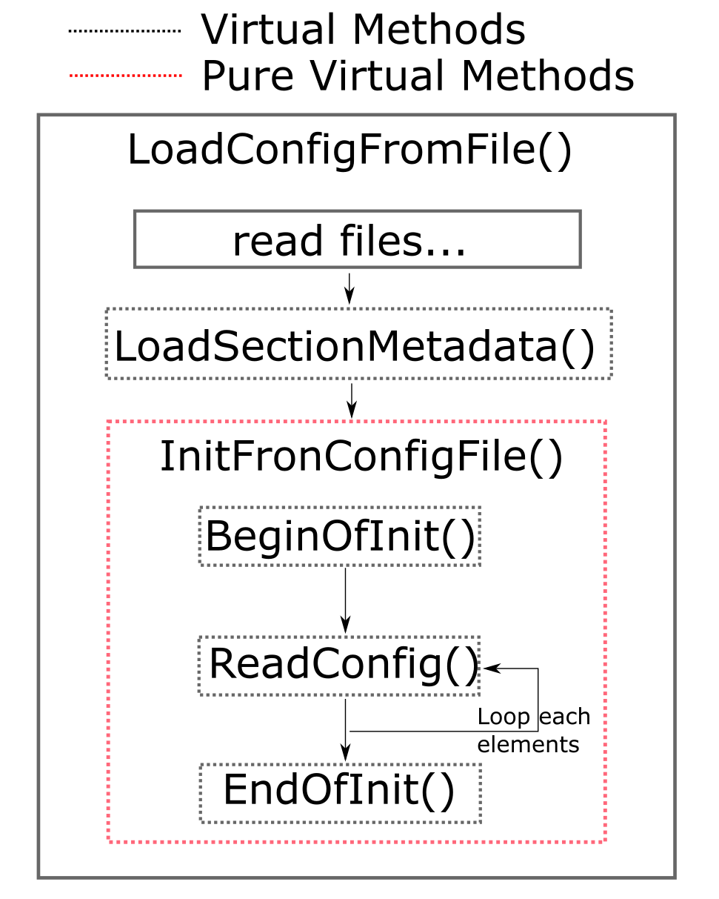

## Base Class Interface Reference

The users are welcomed to develop new classes based on REST. In this section, we will talk about the 
interface of classes when one is going to write his own derived classes. We will first cover some 
points of inheriting the class TObject, which is the base class of many REST base classes. Then we will
talk about the three main base classes in REST: TRestEvent, TRestMetadata and TRestEventProcess. Both
of them are abstract class.

### TRestStringOutput

REST uses this tool class to do message output in a colorful and leveled style. There are several pre-defined 
output objects, just like cout:

fout            | It will always display the message. The message will be in middle of the window with color bold blue.
essential       | It will display the message when verbose level is >= REST_Essential. The message is in middle with color bold green.
info            | It will display the message when verbose level is >= REST_Info. The message is left orientated with color bold green.
ferr            | It will display the error. The message is left orientated with color bold red.
warning         | It will display the warning when verbose level is >= REST_Essential. The message is left orientated with color bold yellow.
debug           | It will display the message when verbose level is >= REST_Debug. The message is left orientated with color white.
extreme         | It will display the message when verbose level is >= REST_Extreme. The message is left orientated with color white.
success         | It will display the message when verbose level is >= REST_Info. The message is left orientated with color bold green.
metadata        | It will display the message when verbose level is >= REST_Essential. The message is left orientated with color bold green.

The verbose level is REST_Silent < REST_Essential < REST_Info < REST_Debug < REST_Extreme.
There is a global variable, `gVerbose`, for these output objects to compare. global verbose level is overriden 
in metadata classes.

TRestStringOutput allows the user to set output color, border, length and orientation. To set colors, 
use the method TRestStringOutput::setcolor(). For example: 

`fout.setcolor(COLOR_RED)`

Here COLOR_RED is one of the pre-defined colors in REST, in the following list.

Name of Color | actual value(type: const char*)
-------------|------------
COLOR_RESET   |  "\033[0m"
COLOR_BLACK   |  "\033[30m"      
COLOR_RED     |  "\033[31m"      
COLOR_GREEN   |  "\033[32m"      
COLOR_YELLOW  |  "\033[33m"      
COLOR_BLUE    |  "\033[34m"      
COLOR_MAGENTA |  "\033[35m"      
COLOR_CYAN    |  "\033[36m"      
COLOR_WHITE   |  "\033[37m"      
COLOR_BOLDBLACK   |  "\033[1m\033[30m"      
COLOR_BOLDRED     |  "\033[1m\033[31m"      
COLOR_BOLDGREEN   |  "\033[1m\033[32m"      
COLOR_BOLDYELLOW  |  "\033[1m\033[33m"      
COLOR_BOLDBLUE    |  "\033[1m\033[34m"      
COLOR_BOLDMAGENTA |  "\033[1m\033[35m"      
COLOR_BOLDCYAN    |  "\033[1m\033[36m"      
COLOR_BOLDWHITE   |  "\033[1m\033[37m"      
COLOR_BACKGROUNDBLACK   |  "\033[1m\033[40m"      
COLOR_BACKGROUNDRED     |  "\033[1m\033[41m"      
COLOR_BACKGROUNDGREEN   |  "\033[1m\033[42m"      
COLOR_BACKGROUNDYELLOW  |  "\033[1m\033[43m"      
COLOR_BACKGROUNDBLUE    |  "\033[1m\033[44m"      
COLOR_BACKGROUNDMAGENTA |  "\033[1m\033[45m"      
COLOR_BACKGROUNDCYAN    |  "\033[1m\033[46m"      
COLOR_BACKGROUNDWHITE   |  "\033[1m\033[47m"      

### TRestReflector

Reflection means a mapping from string type class/classmember name to the actual address of the 
class/classmember. For example some times we need to write a config file to set values for a hundred of 
class members. The actual lines in the config file may be just several, but we need to parpare a hundred
of lines like:   
`par1=GetParameter("par1","")==""?0:StringToInteger(GetParameter("par1"));`  
in the code. Of course we don't want to write like this. In this case we need reflection. 

Another example is that when we are writing a base class, we usually want to make it easier to inherit. 
We want to directly implement the InitFromConfigFile() method for all of the derived class. How can we 
set the class members' value even when we don't know them? We also need reflection. Note that if the 
class member has no ROOT streamer(annotation //! is added after member definition), the reflection
won't work for it. 

### TObject

Classes inherited from TObject can be saved in both TFile and TTree. If one wants to save his data
in REST, it is recommended to write a data class inherited from TObject and save the class directly. 
Note that the name of the header file must be the same as the class defined in it. Otherwise CINT and TClass 
won't work for the class. For example, in file TRestHits.h, we write:

`class TRestHits : public TObject{`  
`public:`  
`//some class members`  
`//some methods`  
`}`  

The source code will first get compiled with CINT. This compiler will generate an additional .cxx file 
implementing the Streamer() method. This method, provided by TObject, will help to save the class members.
Both public, protected and private class members can be saved.

Sometimes it is not necessary to save all the class members in a class. Some class members may be too large,
or contains temporary data. In this case we can turn them off by adding some annotations after their 
declaration in the header file. For example:

`class TRestHits : public TObject{`  
`public:`  
`int a; //!`  
`int b;`  
`}`  

Then the class member "a" will not be saved when the class TRestHits gets saved in TFile/TTree. In TTree we
are unable to see the "a" branch. In TFile when we retrieve the class and get the class object, the class
member "a" will be its default value.

If the class member is a pointer, we cannot save it directly. We need to either add "//->" annotation in 
the same line(not tested), or create and link an instance of the pointer, then save the instance. There 
are two ways to do it, as shown in the code below. 

`1)`  
`TH1D* h; //->`  

`2)`  	
`TH1D* h; //!`  
`TH1D _h;`  
`//in some method before saving`  
`_h=*h;`  

If one directly saves the pointer(adding no comments for CINT), he will get a memory leak problem when 
reading the saved file later on. This problem is fatal when the class is in a tree, and he is trying to 
loop all the entries to, e.g. draw something.. 

### TRestEvent

#### class member
This is an abstract class inherited from TObject. We have some additional class members defined in it.

Type | Name | Description
-------------|------------|-------------
Int_t      |   fRunOrigin;	       | Run ID number of the event
Int_t      |   fSubRunOrigin;      | Sub-run ID number of the event
Int_t      |   fEventID;           | Event identificative number. (Default: 0)
Int_t      |   fSubEventID;        | Sub-Event identificative number. (Default: 0)
TString    |   fSubEventTag;       | A short length label to identify the sub-Event. (Default: "")
TTimeStamp |   fEventTime;         | Absolute event time. (Default: 0)
Bool_t     |   fOk;                | Flag to be used by processes to define an event status. (Default: true)

All of these class members are in hidden level "protected", which means we can directly use them in the 
inherited classes, while cannot access to them in the other classes. In other classes, we need to call
getter and setter methods of TRestEvent. e.g. GetID(), GetSubEventTag(), SetTime(), etc.

These seven class members contains basic and universal infomation of an event. In the derived class, the user
needs to add more class members to store event data. For example, in class TRestRawSignalEvent, we 
define a vector of TRestSignal object and store all the readout wave forms in it.  

#### virtual methods
Initialize() is a pure virtual method in TRestEvent. So in derived classes the user **must** implement it. 
This method is used to reset data in the class. In the base class TRestEvent, this method resets values of:
fEventID, fSubEventID, fSubEventTag, fEventTime and fOk (Note that run origin of the event won't be reset). 
When one is going to implement this method in derived class, he can first call TRestEvent::Initialize() 
and set these five universal class members, before reseting other defined class members. The followings are 
some example codes in TRestRawSignalEvent.

`void TRestRawSignalEvent::Initialize(){`  
&emsp;`TRestEvent::Initialize();`  
&emsp;`fSignal.clear();`  
&emsp;`fPad = NULL;`  
&emsp;`gr = NULL;`  
&emsp;`mg = NULL;`  
&emsp;`fMinValue = 1E10;`  
&emsp;`fMaxValue = -1E10;`  
&emsp;`fMinTime = 1E10;`  
&emsp;`fMaxTime = -1E10;`  
`}`  

PrintEvent() is a virtual method used for printing data of the event. By default it prints only five universal
class members of the event: fEventID, fSubEventID, fSubEventTag, fEventTime and fOk. To print more details,
one needs to implement it in the derived class. For example, in TRestRawSignalEvent, we make a print of the
value of waveforms of each signal.

DrawEvent() returns a TPad object containing the plot of the event. It is called in TRestGenericEventViewer.
By default the method returns a blank pad. To enable the functionality of drawing, one needs to implement this. 

#### useful methods and tools

The virtual method CloneTo() defines how the data in an event is cloned to another existing event. This method 
by default calls ROOT streamer to do cloning. It is already functional for all the derived classes. However,
one can still override this default behavior in the derived class. This may improve the efficiency in some cases.
Also,when we hide some class members againist ROOT streamer, by overriding this method, we can still copy them 
if we want them.

PrintAddress() is used for debugging. It prints the address of this event together with the address of its class
members.

SetEventInfo() copies only the universal information from the input event. It is used when we want to manually 
transfer an event and not to use CloneTo();

### TRestMetadata

This is an abstract class inherited from TNamed (TNamed is inherited from TObject). To write a TRestMetadata inherited
class, there is a pure virtual method InitFromConfigFile() which everyone needs to implement. This method defines
how this class loads data from rml config file. As there is too many methods in the class, we just explain
roughly its logic here. For detailed class reference, check the 
[doxygen website](https://sultan.unizar.es/rest/classTRestMetadata.html).

#### startup of TRestMetadata

Derived class can have the same start up strategy defined in TRestMetadata. The main starter method 
InitFromConfigFile() needs to be called manually after or in the constructor. For example:

// in constructor  
`TRestReadout::TRestReadout( const char *cfgFileName, string name) : TRestMetadata (cfgFileName){`  
&emsp;`cout << "Loading readout. This might take few seconds" << endl;`  
&emsp;`Initialize();`  
&emsp;`LoadConfigFromFile( fConfigFileName, name );`  
`}`  

`int main(){`  
&emsp;`TRestReadout*readout=new TRestReadout("readout.rml","strippedReadout");`  
&emsp;`...`  
`}`  

or  
// after constructor  
`int main(){`  
&emsp;`TRestReadout*readout=new TRestReadout();`  
&emsp;`readout->LoadConfigFromFile("readout.rml");`  
&emsp;`...`  
`}`  

In method LoadConfigFromFile(), we first open the given rml file and find the corresponding xml section in it.
The xml section, wrapped by tinyxml class "TiXmlElement", is saved in the TRestMetadata class. Then the method
LoadSectionMetadata() is called, which sets name, title and verboseLevel for the class. It also makes some 
parpration with config xml section (expand for loop, replave env, etc.). Then the method InitFromConfigFile() 
is called. This method is pure virtual and must be implemented in the derived class.

InitFromConfigFile() is implemented to give the startup logic. Specially, when we are doing sequential 
startup, it is good to write some methods which loops up all the child elements in config xml section.

For example, in most of the process classes, we implement the method directly to load config file, by 
calling method GetParameter():

`void TRestRawSignalTo2DHitsProcess::InitFromConfigFile(){`  
&emsp;`fSelection = GetParameter("selection", "0");`  
&emsp;`fBaseLineRange = StringTo2DVector(GetParameter("baseLineRange", "(5,55)"));`  
&emsp;`...`  
`}`  

In TRestManager, we implement with sequential startup:

//TRestManager.h  
`void InitFromConfigFile() {`  
&emsp;`if (fElement != NULL){`  
&emsp;&emsp;`TiXmlElement*e = fElement->FirstChildElement();`  
&emsp;&emsp;`while (e != NULL){`  
&emsp;&emsp;&emsp;`ReadConfig(...)`  
&emsp;&emsp;&emsp;`e = e->NextSiblingElement();`  
`}}}`  
`Int_t ReadConfig(string keydeclare, TiXmlElement* e);`  

//TRestManager.cxx  
`Int_t TRestManager::ReadConfig(string keydeclare, TiXmlElement* e){`  
&emsp;`if (Count(keydeclare, "TRest") > 0){...}`  
&emsp;`else if (keydeclare == "addTask") {...}`  
&emsp;`return -1`  
`}`

#### other virtual methods

The startup method LoadSectionMetadata() and Initialize() can be overriden by child classes.

We also provide interface of printing in the method PrintMetadata(). REST macros like REST_PrintMetadata 
call this method and print the information on screen. The user needs to implement it in some times.

#### string output

In TRestMetadata, the string output tool will compare the verbose level of the class instead of gVerbose.
For example, if we write in the metadata class's code:

`fout << "hellow world" << endl;`  
`debug << "Setting input event..." << endl;`

If verbose level of this metadata class is set to be higher than(or equal to) REST_Debug, 
the second message will automatically be shown. Otherwise there will only be the first message on screen. 

The string output tool will also write the messages to the class's message buffer if its verbose level 
is lower than REST_Info. The limit is 1000 bytes. We can retrieve the message from ROOT file later on.

#### rml methods

Here we list roughly the main rml methods in TRestMetadata. To look for more details, check the 
[doxygen website](https://p3.doxygen.pandax.sjtu.edu.cn/classTRestMetadata.html).

Return Type | Name | Number of Overloads | Description
-------------|------------|-------------|-----------
std::string   | GetParameter                  | 3 | Basic "GetParameter" functionality. Search in system env, section attribute value and "parameter" child section in sequence.
std::string   | GetFieldValue                 | 2 | Basic "GetParameter" functionality. Search only in section attribute value.
double        | GetDblParameterWithUnits      | 3 | Basic "GetParameter" functionality. Search unit definition near the parameter, and convert the value to double automatically.
TVector2      | Get2DVectorParameterWithUnits | 3 | Basic "GetParameter" functionality. Search unit definition near the parameter, and convert the value to TVector2 automatically.
TVector3      | Get3DVectorParameterWithUnits | 3 | Basic "GetParameter" functionality. Search unit definition near the parameter, and convert the value to TVector3 automatically.
TiXmlElement* | GetRootElementFromFile        | 1 | Tinyxml interface. Open an xml file and returns its root element.
TiXmlElement* | GetElement                    | 3 | Tinyxml interface. Finds the xml element with certain decalration, wraps it as class TiXmlElement.
TiXmlElement* | GetElementWithName            | 2 | Tinyxml interface. Finds the xml element with certain decalration and name attribute, wraps it as class TiXmlElement.
TiXmlElement* | StringToElement               | 1 | Old xml parser interface. Convert std::string to an xml element.
std::string   | ElementToString               | 1 | Old xml parser interface. Convert an xml element to string.
std::string   | GetKEYStructure               | 5 | Old xml parser interface. Get directly a string of xml section from either another string or TiXmlElement
std::string   | GetKEYDefinition              | 4 | Old xml parser interface. Get directly a string of xml section, exclude its child sections.

In most cases we just write a simple class with few class members to set from rml config file. We can simply use
GetParameter() to do the setting.

### TRestEventProcess

#### methods to implement

The most frequent case of developing REST is to write or modifiy an event process. TRestEventProcess is 
inherited from TRestMetadata, adding extra interfaces and tools to it. We need to implement 
additional methods to write the concrete process. The followings are a list of them. 
The bold ones must be implemented by the user.

* **virtual void InitFromConfigFile()**  
* **virtual any GetInputEvent()**  
* **virtual any GetOutputEvent()**  
* virtual void InitProcess()  
* **virtual TRestEvent *ProcessEvent( TRestEvent *evInput )**  
* virtual void EndProcess()  

The method `InitFromConfigFile()` is inherited from TRestMetadata and must be implemented. Usually we call
several GetParamater() methods to read parameters in the config file.

`GetInputEvent()` and `GetOutputEvent()` tells how to get the process's input and output event. Their returned type
is "any", which means you can directly write the concrete event as return value: 

`class TRestRawSignalAnalysisProcess :public TRestEventProcess {`  
&emsp;`private:`  
&emsp;`//we define specific pointer of TRestEvent in class`  
&emsp;`TRestRawSignalEvent *fSignalEvent;//!`  
&emsp;`...`  
&emsp;`public:`  
&emsp;`any GetInputEvent() { return fSignalEvent; }`  
&emsp;`any GetOutputEvent() { return fSignalEvent; }`  
`}`  

During launch, REST will check the input-output event type of each process to make sure the process chain 
is vailed. The input event type of the last process must be same as the output event type of the former process.
It is possible to define generic input/ouput event, by setting the event type as base type `TRestEvent*`. 

After the input-output check, REST will call the method `InitProcess()` for each loaded process. Some values 
should be cleared/reset here in case the process needs to run again. 

The method `ProcessEvent()` must be implemented as the main data analysis logic. It receives an event and returns 
an event. `fSignalEvent` should firstly be assigned as the recieved event with force type transform. 
Then we can write whatever the logic he wants. e.g., calculating integral of the event. It shall return 
fSignalEvent at the end. We can also return null somewhere in the method. In this case, REST will regared the 
event to be **cut**. It will not proceed the remaining data process nor saving this event to the output file. 
The following is an example:

`TRestEvent* TRestRawSignalAnalysisProcess::ProcessEvent( TRestEvent *evInput ){`  
&emsp;`fSignalEvent = (TRestRawSignalEvent *)evInput;`    
&emsp;`Double_t thrIntegral = fSignalEvent->GetThresholdIntegral();`
&emsp;`SetObservableValue("ThresholdIntegral", thrIntegral);`
&emsp;`if(...){`  
&emsp;&emsp;`return NULL; // cut the event`  
&emsp;`}`  
&emsp;`...`  
&emsp;`return fSignalEvent;`  
`}`  

The method `EndProcess()` is a method to be called after all the events are finished. Some additional jobs 
can be done here. For example, we can show a message about the process status in this method. Or, we can
call saving for a TH1D object to the output file.

#### saving observables

It is simpler to use observables to store analysis results in the tree. By calling directly the method 
SetObservableValue() inside TRestEventProcess::ProcessEvent(), we add the branch and fill the value at 
once. In future if we want to update the process and add a new observable, we can simply modify the code
by adding a new line of SetObservableValue()

//inside function ProcessEvent()(TRestRawSignalAnalysisProcess.cxx)  
`Double_t baseLineSigma = fSignalEvent->GetBaseLineSigmaAverage( fBaseLineRange.X(), fBaseLineRange.Y() );`  
`SetObservableValue("BaseLineSigmaMean", baseLineSigma );`  

The added observable can be in various types. The basic data types are mostly supported (unsigned long long is 
not supported due to ROOT problem). The stl containers are all supported. We usually save sub-event level 
observables with stl containers. For example the baseline of each signal is stored as `map<int, double>` 
in the tree. 

Observables are named after the process's name. For example, the added observable is "BaseLineSigmaMean",
the process name is "sAna", then the actual branch name will be "sAna_BaseLineSigmaMean".

#### automatic cut evaluation

REST provides an automatic cut evaluation method `ApplyCut()` for the processes. This method checks the observable
value of this process. If it is out of specified range, it will return true. Then we can return NULL in the 
process's code. For example: 

`SetObservableValue("MinPeakTime", 20);`  
`if (ApplyCut()) return NULL;`  

The cut is defined in process's rml file. Only double and int observables are accepted.

`<addProcess type="TRestRawSignalAnalysisProcess" ...>`  
&emsp;`<parameter name="cutsEnabled" value="true" />`  
&emsp;`<cut name="MinPeakTime" value="(1,10)" />`  
`</TRestRun>`  

We can see that the observable "MinPeakTime" is out of range (1,10), so the event will be cut.

#### single thread process

Processes can be set to single thread only by a bool value "fSingleThreadOnly". This option is for some 
special processes like external process and viewer process. The external processes read external data file,
and the viewer process displays event figure. They cannot be executed in parallel. Set its value to true in 
the constructor. 

REST will only activate one thread if a single thread process exists in the process chain.
(note that external process does not belong to the process chain.)

#### other class members

TRestEventProcess keeps the following pointers that may be useful:

Type | Name | Description
-------------|------------|-------------
TRestAnalysisTree*            | fAnalysisTree      | The pointer to analysis tree, we usually call fAnalysisTree->SetObservableValue()
TRestRun*                     | fRunInfo           | The pointer to TRestRun, which can provide the process with some metadata objects and run information in some cases.
vector&lt;TRestEventProcess*> | fFriendlyProcesses | A list to all the friendly processes in the process chain. We may need to use the analysis result of other processes in some cases.
TCanvas*                      | fCanvas            | A TCanvas object for drawing.

We also implemented a series of methods GetXXXMetadata(). For example to get the data of readout definition,
we can simply use  
`fReadout = (TRestReadout*)GetReadoutMetadata();`  
in the class's method funciton. The alternative call is:  
`fReadout = (TRestReadout*)fRunInfo->GetMetadata("TRestReadout")`

[**prev**](6-some-metadata-classes.md)
[**contents**](0-contents.md)
[**next**](8-start-your-own-analysis-with-rest.md)