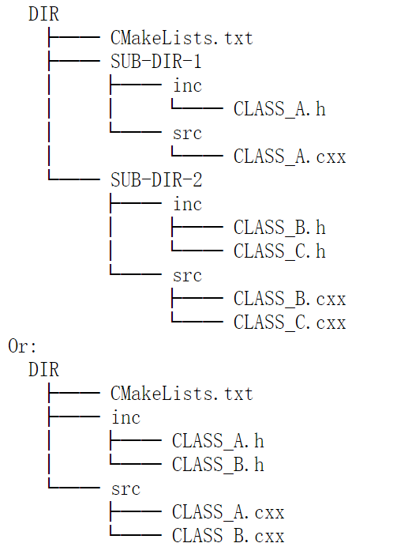

## Start Your Own Analysis with REST

We may engage a new analysis request which REST is unable to handle. It is possible to modify/add processes
to REST source code, or to develop a new project based on REST. The project can either be a program running 
separately, or a library added into REST libraries.

### Modify an existing process

To customize our analysis, we start from modifing an existing TRestEventProcess class. We take an example
of adding new analysis items in TRestRawSignalAnalysisProcess. Assume we are going to investigate signal
peaks in an event. We would like to add a map of signal id to signal peaks. We also like to add an 
observable of mean peak value.

We add several lines in the cxx file:

`//inside function ProcessEvent()(TRestRawSignalAnalysisProcess.cxx)`  
`...`  
`map<int,Double_t> signalpeakvalue;`  
`int signalpeaksum = 0;`  
`for (int s = 0; s < fSignalEvent->GetNumberOfSignals(); s++){`  
&emsp;`TRestRawSignal *sgnl = fSignalEvent->GetSignal(s);`  
&emsp;`signalpeaksum += sgnl->GetMaxPeakValue();`  
&emsp;`signalpeakvalue[sgnl->GetID()] = sgnl->GetMaxPeakValue();`  
`}`  
`SetObservableValue("SignalPeakMean", signalpeaksum / fSignalEvent->GetNumberOfSignals());`  
`SetObservableValue("SignalPeakValue", signalpeakvalue);`  
`...`  

After changing the source code, we need to switch to the build directory and type `make install`.
Then, TRestRawSignalAnalysisProcess will be working in a new way. We don't need to change the rml 
file or the header file. The class definition would remain unchanged. 

### Add a class to souce code

REST auto detectes source files in its directories. During the making, Cmake makes use of all the .h and .cxx
files in the sub inc/src directories of each working directory. In concrete, the regular form of 
directory order is:



Cmake first targets on a .cxx file. It regards the file name as the class name. Then it searches the .h file
of this class. If found, it calls CINT to make a wrapper for the class with this .h file. ROOT CINT genertes
a new .cxx file for the .h file, containing some streamer methods and reflection methods which overwrites 
those in TObject class. Each .h file can only contain one TObject inherited class whose name must be the 
same as the file name. Then Cmake includes that .h file and complies the two .cxx files calling gcc. This 
work is done for all .cxx files, after which CMake generates a library with the name of the directory.

As for the user, after adding a new class, he just needs to rerun the command `cmake PATH [options]` followed 
by `make install` in the build directory. Alternativelly he can switch to ./script directory and call
`python scriptsInterface.py`.

To add a new process, we suggest copying the header file and the source file of our template dummy process. 
They are in the directory ./packages/userRESTLibrary, named "mySignalProcess". First rename the files and 
replace all the instance of "mySignalProcess" into your process name. Then add your class member and implement
your InitFromConfigFile() method. It will be convenient to use GetParameter() and StringToDouble() methods 
to set configurations from rml file. Then define your input and output event type, by using code like:
`fInputEvent = new TRestxxxEvent();`. Finally implement your ProcessEvent() method which is for the main 
analysis loop. A new process is ready!

Adding new event class or metadata class shall be similar.

### Build another project and work with REST

It is possible to write a code based on REST and compile it. We can make a library which extends 
functionality to REST mainbody, or we can make an executable calling REST classes.

In the directory ./packages/userRESTLibrary, we have a library project which can directly be compiled.

~/REST_v2$ `cd packages/userRESTLibrary`  
~/REST_v2/packages/userRESTLibrary$ `mkdir build`  
~/REST_v2/packages/userRESTLibrary$ `cd build`    
~/REST_v2/packages/userRESTLibrary/build$ `cmake ..`  
~/REST_v2/packages/userRESTLibrary/build$ `make install`  

The default installation path of this project is "userRESTLibrary/lib". If we add this to our 
LD_LIBRARY_PATH:

`export LD_LIBRARY_PATH=$LD_LIBRARY_PATH:$HOME/REST_v2/packages/userRESTLibrary/lib`

Then REST will load this library at its startup, new classes in it will be available.

To build our own executable based on REST, we can take a look at restG4. To use REST classes we just 
need to include corresponding headers. To use reflection functionalities we need to dynamically load 
REST libraries in the program. For example:

//in file test.cxx

`#include "TRestRun.h"`  
`#include "TRestGas.h"`  

`int main(int argc, char *argv[]){`  

`TRestTools::LoadRESTLibrary(true);`  
`TRestRun *run = new TRestRun();`  
`run->OpenInputFile("abc.root");`  
`TRestGas *gas = (TRestGas *)run->GetMetadataClass("TRestGas");`  
`gas->InitFromRootFile();`  
`cout<<gas->GetDriftVelocity(70)<<endl;`  

`}`  

If we remove the 4th line, there will be a warning message from TRestGas telling us REST cannot 
use gas utility. Because the gas library needs to be dynamically loaded.

Note that this source file uses only REST and ROOT6. Such file can be compiled into 
library/executable with a single command:

* library: ``gcc test.cxx -std=c++11 -I`root-config --incdir` -I`rest-config --incdir```   
```rest-config --libs` `root-config --libs` -lGui  -lEve -lGeom -lMathMore -lGdml -lMinuit``  
``-L/usr/lib64 -lstdc++ -shared -fPIC -o test.so``

* executable: ``gcc test.cxx -std=c++11 -I`root-config --incdir` -I`rest-config --incdir```  
```rest-config --libs` `root-config --libs` -lGui  -lEve -lGeom -lMathMore -lGdml -lMinuit``  
``-L/usr/lib64 -lstdc++ -fPIC -o test``


[**prev**](7-base-class-interface-reference.md)
[**contents**](0-contents.md)
[**next**](9-rest-packages.md)