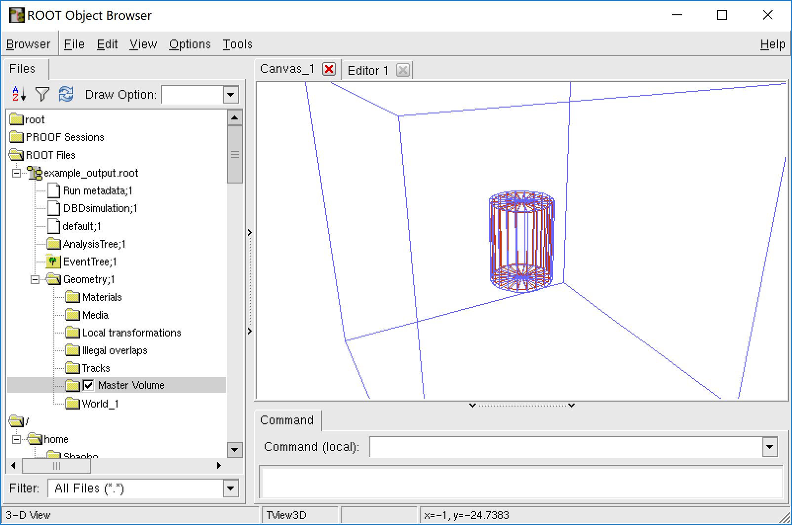

## REST Packages

REST provides extensible functionalities through so-called "packages". They are separate program based 
on REST mainbody and other softwares. They adds libraries and executables to REST installation, thus 
providing new functionalities.

### restG4

restG4 provides an executable named restG4 which refers to both REST and geant4 library. To install it, 
we must have Geant4 and REST mainbody installed. Then use commands `cmake` and `make`, as
instructed in section 2. restG4 is a single-executable program. By default it is installed in REST 
bin directory (${REST_PATH}/bin/). We can directly type `restG4` to start it.

Several example rml files will be added into REST example directory (${REST_PATH}/example/). To start 
our first geant4 simulation, we enter this directory and run restG4:

:~$ `cd $REST_PATH/example/restG4template`

:restG4template$ `restG4 restG4.rml`

Then a geant4 simulation will start for 100 events, generating a file "example_output.root". This root file 
contains a TTree with branch "TRestG4EventBranch", and a TGeoManager named "Geometry". We can view them 
in TBrowser.

With restG4, we can do a two-step simulation to test our detector response. First use restG4 to generate 
root file with raw event data. Then use REST build-in processes to convert this root file into signal 
event(readout waveform), which is very close to the data we get from real world detector. Then we can try
our analysis algorithm upon this simulation data. 

For example, we process the previous output file with the example rml:

:restG4template$ `restManager --c ../simDataAnalysis.rml --i example_output.root --o abc.root`

This gives us information of cut efficiency of track recognition.

### restDecay0

...

### restSQL

...

[**prev**](8-start-your-own-analysis-with-rest.md)
[**contents**](0-contents.md)
[**next**](appendix.md)