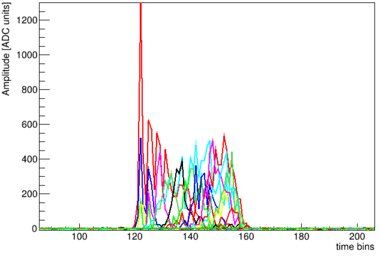
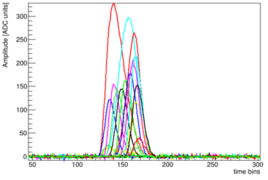
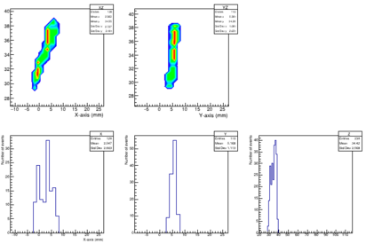
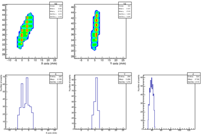

This example shows how to include the detector response and the reconstruction of tracks from the raw detector data that has been at the same time produced from Geant4 MC data. 

The processes included have been adapted to facilitate the reconstruction of short energetic alpha tracks. Before using the example it is necessary to generate the Geant4 event MC data. You may use the following restG4 [example](https://github.com/rest-for-physics/restG4/examples/08.Alphas).

A quick recipe to generate the necessary data follows.

Copy this example at your working directory. Then copy the restG4 generator example.

```
cd myWorkDir
cp -r $REST_PATH/examples/01.alphaTrack .
cd 01.alphaTrack
cp -r $REST_PATH/examples/restG4/08.Alphas .
export REST_FOIL=1
export REST_ENERGY=5
mkdir data
restG4 08.Alphas/alphas.rml
```

This will produce an initial ROOT file that contains the simulated Geant4 event data.

In order to further process the data we need to execute:

```
restManager --c processing --f data/Run_5MeV_1um.root
```

The processing includes the electron diffusion, the readout segmentation, and shaping and noise signal effects.
The full data processing is disabled by default, there are a few variables that control the depth of the data processing.

 * **RAW_PROCESSING**: It will extend the processing to get detector electronics like signals.
 * **HIT_PROCESSING**: It will extend the processing to reconstruct the detector raw data using the readout definition (See also readout [README.md](readout/README.md)).
 * **TRACK_PROCESSING**: It will extend the processing to reduce the hits and identify the physical track (Few processes are missing yet).

Those variables are dependent between them, and if one of them is enabled, all the previous ones must be enabled too. For example, if `TRACK_PROCESSING` is enabled, then `RAW_PROCESSING` and `HIT_PROCESSING` should be enabled too.

Additionaly, one may enable electronics shaping in the raw detector signal production by enabling an additional variable `SHAPING=ON`.

Those variables may be defined externally at the command shell executing

```
export RAW_PROCESSING=ON
```

or they might be modified inside the corresponding RML file.

Events may be visualized using:

```
restRoot data/Response_5MeV_1um.root
run0->GetEventWithId(9893);
TCanvas c;
ev0->DrawEvent("hist(Cont0,col)[1]");
```

Those commands were used to generate the following plots. That correspond with different levels of processing by enabling `RAW_PROCESSING`, `HIT_PROCESSING` and `TRACK_PROCESSING`, with `SHAPING` disabled/enabled.








