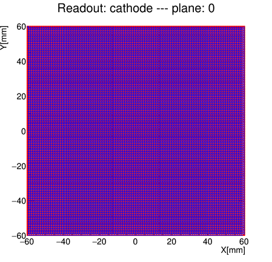

Minimal script to generate the readouts file:

```
TRestDetectorReadout *r1 = new TRestDetectorReadout("readouts.rml", "readout" );
TRestDetectorReadout *r2 = new TRestDetectorReadout("readouts.rml", "cathode" );

TFile *f = new TFile( "readouts.root", "RECREATE" );
r1->Write("readout");
r2->Write("cathode");

f->Close();
```


Minimal script to visualize the readout:


```
restRootMacros
REST_Detector_ViewReadout("readouts.root", "cathode")
```


